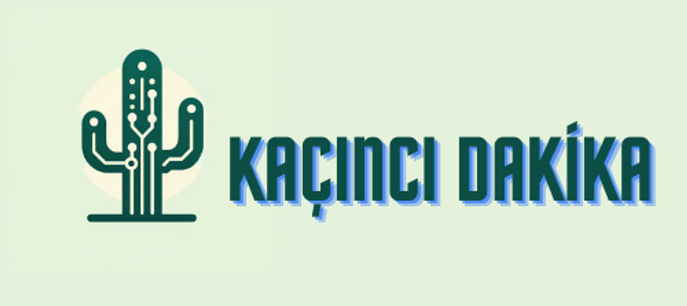

<div align="center">

</div>

<div align="center">

</div>
<br>


#medyahackathonu2024


# Kurulum
* ## Sistem Gereksinimleri

* ## Gerekli kütüphanelerin Kurulumu
    ```
    pip install -r requirements.txt
    ```
* [OpenAI] API KEY (https://openai.com/) almak gereklidir
  
* Angular ve Node.js kurummları gereklidir

* ```
    npm install -g @angular/cli
    ```

* ```python
  npm install 
    ```
  

    ```python
    git clone [https://github.com/KullanıcıAdı/proje.git](https://github.com/Muhammedali26/HangiDakika.git)

    ```

# Kullanım
* Ses(mp3,wav) ,video(mp4,) desteklemektedir


# Lisans
Bu yazılım AnadoluAjansı'ne ait bir üründür. Bu yazılımın kullanımı, kopyalanması veya dağıtılması sadece AnadoluAjansı'nin izniyle ve belirtilen kullanım koşulları altında yapılabilir.
