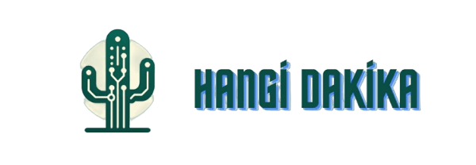

<div align="center">

</div>

<div align="center">

</div>
<br>


#medyahackathonu2024


# Kurulum
## Sistem Gereksinimleri

## Gerekli kütüphanelerin Kurulumu

```
pip install -r requirements.txt
```
* OpenAI API KEY (https://openai.com/) almak gereklidir
  
* Angular ve Node.js kurummları gereklidir

```
npm install -g @angular/cli
```

```
npm install 
```
  


# Kullanım
Ses(mp3,wav) ,video(mp4,) desteklemektedir

# Katkıda Bulunanlar

- [@glcsvg](https://github.com/glcsvg)
- [@Muhammedali26](https://github.com/Muhammedali26) 
- [@ynkbrk ](https://github.com/ynkbrk ) 
- [@halittefe ](https://github.com/halittefe )


# Lisans
Bu yazılım AnadoluAjansı'ne ait bir üründür. Bu yazılımın kullanımı, kopyalanması veya dağıtılması sadece AnadoluAjansı'nin izniyle ve belirtilen kullanım koşulları altında yapılabilir.
